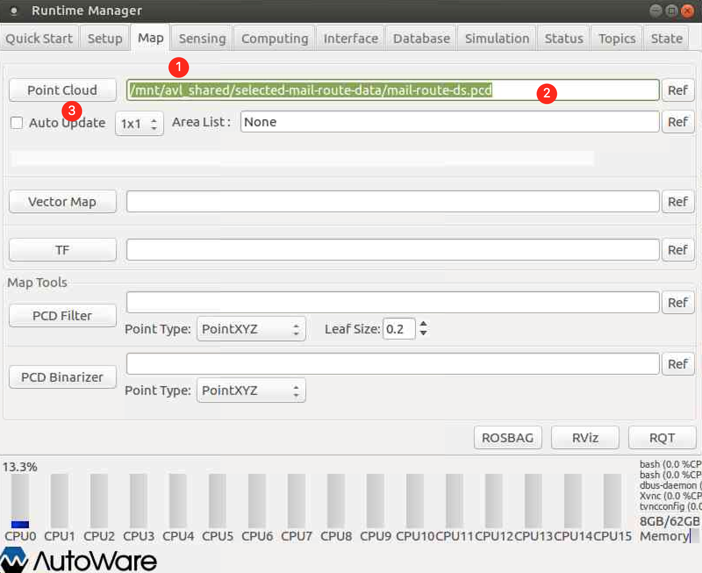
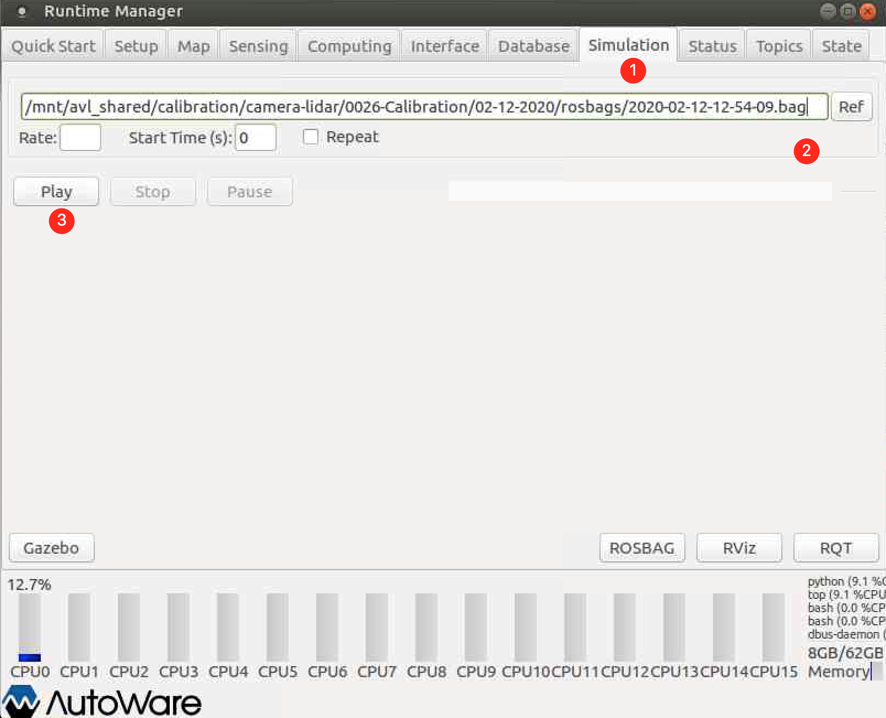

# Probabilistic Semantic Mapping

This is the source code for the paper [Probabilistic Semantic Mapping for Urban Autonomous Driving Applications](https://arxiv.org/abs/2006.04894). It will fuse the LiDAR point cloud with the semantic segmented 2D camera image together and create a bird's-eye-view semantic map of the environment. 

## Set up

Here we are going to show you how to set up the docker environment in order to develop/run our code. 

### Prerequisite

> Warning:  Because we need to use VNC, TurboVNC does not have support for Mac user, so you must use Linux system. 

We are going to use `astuff_autoware_nvidia` docker image as our primary develop environment. Please follow the instruction in the [dockerlogin](https://github.com/CogRob/internal_docs/blob/master/cogrob_dockerlogin.md) to learn how to set up this docker environment. 

We are using Autoware to create the ROS environment where our code depends on. To run Autoware, we need to set up VNC viewer to create a graphical interface with our docker container. Please follow the instruction in the [cluster_vnc](https://github.com/CogRob/internal_docs/blob/master/cluster_vnc.md) to learn how to set up this VNC. 

Now we assume that you are inside the docker container and can view the container via VNC. 

### Step 1. Build Autoware

The pre-installed Autoware in the container does not suit with our development environment. We need to use our modified version of Autoware_v1.8. The source code is [here](https://github.com/AutonomousVehicleLaboratory/Autoware_v1.8). We will create a workspace and install the package here. 

```sh
mkdir -p ~/codebase
cd ~/codebase

git clone https://github.com/AutonomousVehicleLaboratory/Autoware_v1.8

# Then we need to source the ros environment in order to build the Autoware
source /opt/ros/kinetic/setup.bash

# Build Autoware
cd Autoware_v1.8/ros
./catkin_make_release
```

### Step 2. Build ROS Packages

Now we need to create a local ROS workstation, and save all our ROS code there. 

The ROS packages we need are 

1. [map_reduction](https://github.com/AutonomousVehicleLaboratory/map_reduction). This package will extract a local point cloud around the ego vehicle.
2. [out code](https://github.com/AutonomousVehicleLaboratory/vision_semantic_segmentation)

```sh
mkdir -p ~/codebase/ros_workspace/src
cd ~/codebase/ros_workspace/src

# Initialize the workspace
catkin_init_workspace

git clone https://github.com/AutonomousVehicleLaboratory/map_reduction.git
git clone https://github.com/AutonomousVehicleLaboratory/vision_semantic_segmentation.git

# Build the code
cd .. 
catkin_make
```

### Step 3. Run Autoware

We have finished the installation of Autoware in step 1. Now we will show you how to load the data into Autoware and run it.

Now let's first install some dependency so that we can run the Autoware more smoothly. 

```sh
sudo apt update
sudo apt install gnome-terminal
```

**(If you are using the automatic script to build the environment, this is where you should start)**. To run the Autoware, we need to open three terminals. We provide to help you do that automatically. It will also create a new terminal for you to play around with your code. **Note that you have to run this scripts inside the VNC.** (Because Autoware need GUI supports.)

```sh
# In the VNC
cd ~/codebase/ros_workspace/src
bash ./vision_semantic_segmentation/scripts/launch_autoware.sh
```

Now we need to load the point cloud map. Go to the third Tab `Map` in the Runtime Manager. In the first row where you see the "Point Cloud". Paste the following path into the blank bar. 

```
/mnt/avl_shared/selected-mail-route-data/mail-route-ds.pcd
```

Then click the PointCloud to load the map. 



Now go to the `Simulation` Tab, load the following rosbag and Click "Play". Now the rosbag should be load into the ros messaging system. 

```
/mnt/avl_shared/calibration/camera-lidar/0026-Calibration/02-12-2020/rosbags/2020-02-12-12-54-09.bag
```



You can open RViz to view the output image. We provide a default configuration for the RViz in the `scripts/default.rviz`. 

### Step 4. Run our code 

> Note: For this part of the code, you don't have to run inside the VNC. 

Now the Autoware is running and the rosbag has been loaded into the ROS, we are now ready to run our code and start building the semantic map of the environment. 

```sh
cd ~/codebase/ros_workspace

# Install the python package
pip install -r vision_semantic_segmentation/requirements.txt --user

source devel/setup.bash
roslaunch vision_semantic_segmentation camera1_mapping.launch
```

Now we need to set up the configuration for the semantic segmentation network. 

> Note: We have saved the network weight in the `/mnt/avl_shared/qinru/iros2020/resnext50_os8`, you don't have to download it if you are using the cluster. 

1. Download the trained weight from Google Drive (`Living Laboratory-AVLResearch-Papers-Publications-IROS2020-Semantic Mapping-network-resnext50_os8-run1-model_best.pth`), and save it into your path.

2. If you want to change the parameter of the configuration file, you can create your own YAML file and pass it into the `roslaunch` comment. 

   An example of this is 

   ```sh
   roslaunch vision_semantic_segmentation camera1_mapping.launch mapping_args:="--cfg ~/codebase/ros_workspace/src/vision_semantic_segmentation/config/example.yaml"
   ```

   If no configuration file is provided, then we will run the default configuration. The default configuration is defined in `src/config/base_cfg.py`.

Some general explanation about the parameters in the configuration system 

*  `MODEL.WEIGHT` corresponds to the path to the trained weight.
* `DATASET_CONFIG` corresponds to the path to the configuration file of the dataset so that you can visualize the semantic output in color, it is the `config/class_19.json` in this repository.  
* Make sure `DATASET.NUM_CLASSES` is equal to the number of classes. 

### TL;DR

We provide a script for you to automatically setup this development environment. Here is what you need to do

```sh
mkdir -p ~/codebase/ros_workspace/src
cd ~/codebase/ros_workspace/src

git clone https://github.com/AutonomousVehicleLaboratory/vision_semantic_segmentation.git

# Run the script
# You may need to type in your github account multiple times
bash ~/codebase/ros_workspace/src/vision_semantic_segmentation/scripts/initialize_dev_env.sh
```

Then the only thing you need to do is launch Autoware by following Step 3 and 

```sh
# Folloing code will run the default configuration 
source ~/codebase/ros_workspace/devel/setup.bash
roslaunch vision_semantic_segmentation camera1_mapping.launch

# If you want to use your customized configuration, you can do
roslaunch vision_semantic_segmentation camera1_mapping.launch mapping_args:="--cfg [path to your config.yaml]"
# An example
# roslaunch vision_semantic_segmentation camera1_mapping.launch mapping_args:="--cfg /home/users/qinru/codebase/ros_workspace/src/vision_semantic_segmentation/config/qinru.yaml"
```

## To Run Experiment

There are still some none trivial step for you to run our experiment presented in the paper, and that is why we are here to guide you. 

To run the whole map generation, you should first set the `Start Time` in the Simulation Tab of the Autoware to `410`.  Then create an configuration file, and have the following keys set to

```yaml
TEST_END_TIME: 1581541450
MAPPING:
  BOUNDARY: [[0, 1000], [0, 1400]]
  RESOLUTION: 0.2
```

To run a small region of the map for testing, you should first set the `Start Time` to `390`. Then use the following configuration 

```yaml
TEST_END_TIME: 1581541270 # Which is about 20s after 390s. 
MAPPING:
  BOUNDARY: [[100, 300], [800, 1000]]
  RESOLUTION: 0.2		# This one doesn't really matter
```

Then pass these configuration into the roslaunch as shown in Step 4 and click the `Play ` in the Autoware, now you should be good to go!

## Reproducibility

To reproduce our result, you need to 

1. Slow down the replay speed of the rosbag. As the image node will drop package if it is legging behind, the drop of package is uncontrollable and can happen at anytime. Therefore we need to slow down the replay speed to ensure that all the packages are processed. We recommend using `0.1` replay rate. 
2. Set the input image scale to 1.0. The nearest neighbor interpolation from the `cv2` may cause some misalignments and we want to disable that. 
3. Fix the random seed. Set the `RNG_SEED` value in the configuration file to a non zero value so that we can disable any randomness. 

## Credits

Author: David, Henry, Qinru, Hao. 